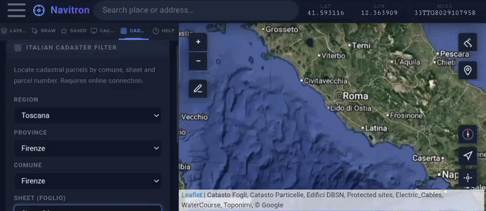

# Navitron GIS

Offline-capable GIS app for Android, built for fieldwork on Italian cadastral parcels — surveyors, agronomists (PAC/AGEA), technicians. Packaged as APK via Apache Cordova; built and tested entirely on-device with Termux + proot-distro.

[](https://www.gnu.org/licenses/gpl-3.0)
[](https://github.com/damianochiappa/navitron/releases/latest)

<p align="center">
  
</p>

---

## Install (recommended)

No build required — download and install the APK:

1. Open the **[latest Release](https://github.com/damianochiappa/navitron/releases/latest)** and download `Navitron.apk`
2. On your phone, allow *Install from unknown sources* for the browser or file manager you use
3. Open the downloaded file and confirm installation

**Requirements:** Android 10+.

> Navitron is sideloaded, not on the Play Store. Android will show an "unknown sources" warning — this is expected.

---

## Features

- **WFS** — live vector features with filtering, style customization, selection export to KML; supports WFS 2.0 + legacy 1.x with GML 3.1.1, ISO-8859-1 encoding, MapServer `?map=...` endpoints; tested on Agenzia delle Entrate (INSPIRE), PCN (minambiente), IGM
- **Catasto (Italy)** — WMS labels + WFS Parcels and Sheets (Agenzia delle Entrate INSPIRE) preloaded; PCN (minambiente) and IGM Italian WFS supported via "Add web map"
- **Cadaster wizard (Italy)** — cascading dropdowns from region to sheet (foglio); optional parcel filter applied to the CadastralParcel layer, with automatic zoom and selection highlight
- **Offline tile cache** — download any basemap within a KML boundary for offline use (Service Worker)
- **KML/KMZ/GeoJSON/GPX import** — layer management, vertex editing, attribute popup, dissolve polygons (turf.js), rename, export
- **Coordinate tools** — go-to by DD/DMS/UTM/MGRS, format converter, bookmarks
- **Maps** — OpenTopoMap, OpenStreetMap, ESRI (Satellite, Topo, NatGeo), Stadia Satellite, CartoDB; custom WMS/WMTS/ArcGIS layers with opacity control
- **GPS** — real-time position, accuracy circle, UTM/MGRS coordinates, terrain elevation (Open-Meteo); flight mode auto-detection (AGL threshold)
- **Navigation** — OSRM routing (driving, cycling, walking); heading-up map rotation with direction arrow; off-route detection and automatic recalculation; speed/distance/ETA HUD; walking view cone
- **Track recording** — GPS track with stats; elevation profile chart; export as GPX or KML
- **Draw & measure** — markers, polylines, polygons, circles; polyline measurement; distance/area calculation
- **ArcGIS Online** — token authentication for protected services

---

## Build from source (advanced, optional)

> This section is only for contributors who want to modify the code. For regular use, install the APK from the [latest Release](https://github.com/damianochiappa/navitron/releases/latest).

### Requirements

- Android device (Android 10+)
- [Termux](https://github.com/termux/termux-app) + proot-distro (Ubuntu)
- Node.js + Cordova CLI 12 (installed in Termux) — uses `cordova-android` 13 platform
- Android SDK 34 + Java 17 (installed in proot Ubuntu by the build script)

### Build

The build runs entirely on-device using Termux. There is no desktop build environment.

**First build** (installs all dependencies automatically):
```bash
bash build_navitron.sh
```

**Incremental build** (assumes first build already completed):
```bash
bash build_navitron_fast.sh
```

> The build scripts are device-specific (paths to `APP_SRC` and `APK_OUTPUT_DIR`); any standard Cordova build workflow works just as well.

The signed APK is written to `output/Navitron.apk`. Signing uses a local keystore generated at first build.

### Private tile providers

The file `app/js/basemaps-private.js` (excluded from this repo via `.gitignore`) can override the default tile URLs at runtime. The HTML loads it silently if present:

```html
<script src="js/basemaps-private.js" onerror="void(0)"></script>
```

Template:
```js
(function () {
  if (typeof BASEMAPS === 'undefined') return;
  BASEMAPS.google_hybrid = L.tileLayer('YOUR_HYBRID_URL/{z}/{x}/{y}', {
    attribution: '...', maxZoom: 20
  });
  BASEMAPS.google_maps = L.tileLayer('YOUR_STREET_URL/{z}/{x}/{y}', {
    attribution: '...', maxZoom: 20
  });
})();
```

---

## License

Copyright (C) 2026 Damiano Chiappa — licensed under **GPL v3**.  
See [LICENSE](LICENSE) for details.

This project is GPL v3 because it uses [leaflet-rotate](https://github.com/Raruto/leaflet-rotate) (GPL v3).  
All other third-party libraries are MIT, BSD-2, or Apache-2.0 — see [NOTICES](NOTICES) and [THIRD-PARTY-NOTICES.md](THIRD-PARTY-NOTICES.md).

---

## Third-party libraries

| Library | License |
|---|---|
| [Leaflet](https://leafletjs.com) | BSD-2-Clause |
| [leaflet-rotate](https://github.com/Raruto/leaflet-rotate) | GPL-3.0 |
| [OpenLayers](https://openlayers.org) | BSD-2-Clause |
| [ESRI Leaflet](https://github.com/Esri/esri-leaflet) | Apache-2.0 |
| [Leaflet.draw](https://github.com/Leaflet/Leaflet.draw) | MIT |
| [Leaflet.PolylineMeasure](https://github.com/ppete2/Leaflet.PolylineMeasure) | BSD-2-Clause |
| [Leaflet.FileLayer](https://github.com/makinacorpus/Leaflet.FileLayer) | MIT |
| [L.KML](https://github.com/shramov/leaflet-plugins) | MIT |
| [turf.js](https://turfjs.org) | MIT |
| [proj4js](https://github.com/proj4js/proj4js) | MIT |
| [mgrs.js](https://github.com/proj4js/mgrs) | MIT |
| [tokml](https://github.com/tmcw/tokml) | MIT |
| [toGeoJSON](https://github.com/mapbox/togeojson) | BSD-2-Clause |
| [JSZip](https://stuk.github.io/jszip) | MIT / GPL-3.0 (dual) |
| utm.js / utmref.js (Johannes Rudolph) | not declared (MIT/LGPL fragments inline) |

