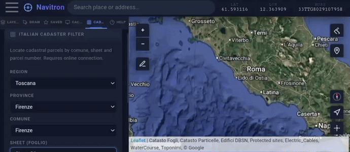
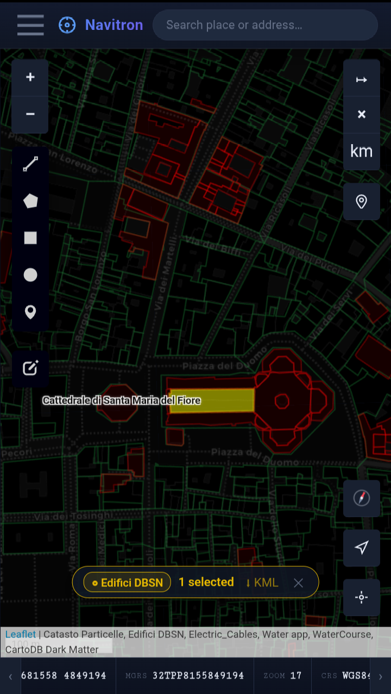
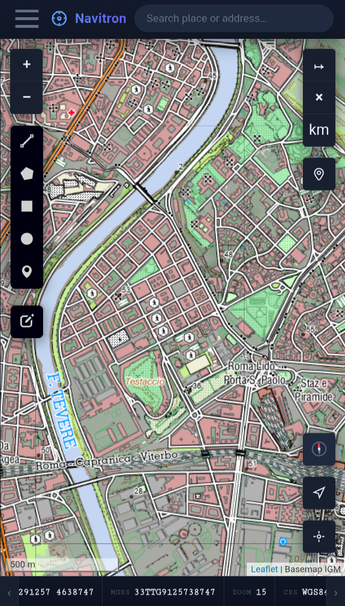

App Android **open source per il catasto italiano**, pensata per il lavoro sul campo: geometri, agronomi (PAC/AGEA), tecnici. Permette l'**interrogazione WFS delle particelle catastali dell'Agenzia delle Entrate** (dati INSPIRE), la **ricerca per comune, foglio e particella**, la **cache delle mappe per l'uso offline** l'**import di KML, KMZ, GeoJSON e GPX** e l'**export in KML, GeoJSON e GPX**. Distribuita come APK tramite Apache Cordova; costruita e testata interamente on-device con Termux + proot-distro.

<small><em>Open-source Android GIS app for the Italian cadastre — WFS parcel query (Agenzia delle Entrate / INSPIRE), search by municipality / sheet / parcel, offline tile cache, KML export.</em></small>

  

  
  

---

## A cosa serve Navitron

Navitron GIS non sostituisce i software catastali professionali: è un'app da campo, pensata per orientarsi sul terreno.

Ti aiuta a individuare un terreno partendo dai dati catastali — comune, foglio e particella — e a riconoscerlo sulla mappa satellitare. Con il GPS raggiungi la particella sul posto e ti orienti tra confini, fabbricati, strade e corsi d'acqua, anche senza connessione grazie alle mappe salvate per l'uso offline.

I dati catastali dell'Agenzia delle Entrate sono già preconfigurati e attivi all'avvio: particelle e fogli del Catasto Terreni (WFS vettoriale), le etichette delle particelle, il Catasto Fabbricati, il Catasto Acque, il Catasto Strade e i confini provinciali (overlay WMS). I livelli catastali di dettaglio compaiono man mano che zoomi — l'Agenzia li pubblica solo oltre una certa scala — mentre le province si vedono già a scala ampia. Catasto e altri tematismi si sovrappongono alla mappa di sfondo che preferisci — satellitare, topografica o stradale — e di ogni livello puoi regolarne l'opacità (e il colore, per i livelli vettoriali come le particelle catastali) per confrontarlo con il terreno sottostante. Puoi aggiungere altri livelli cartografici indicandone l'indirizzo una sola volta: restano salvati e si ricaricano agli avvii successivi. Sono supportati servizi pubblici come la cartografia INSPIRE di IGM e Geoportale Nazionale e — con le relative credenziali — i servizi ArcGIS/ESRI della tua organizzazione, nei formati WMS, WFS, WMTS/XYZ e ArcGIS MapServer.

**Per chi è pensato**

- **Proprietari** — individui un terreno che possiedi o hai ereditato partendo dagli estremi catastali, anche senza conoscere la zona.
- **Agricoltura** — individui i tuoi campi, li riconosci sul terreno prima delle lavorazioni e prepari le pratiche PAC/AGEA esportando le particelle in KML o GPX.
- **Geometri, periti e tecnici** — sopralluoghi e consultazione catastale sul campo: ricerca per comune, foglio e particella, sovrapposizione di più livelli, lettura e conversione delle coordinate (DD, DMS, UTM, MGRS), modifica dei vertici.
- **Fotovoltaico, agrivoltaico ed eolico** — individui rapidamente le particelle di interesse per valutare terreni adatti agli impianti da fonti rinnovabili.
- **Settore forestale** — riconosci i confini delle particelle prima di un taglio o di un intervento, direttamente sul terreno.

In tutti i casi puoi navigare verso una destinazione (auto, piedi o bici, con ricalcolo automatico del percorso), registrare tracce GPS, disegnare, misurare aree e distanze, unire più particelle in un'unica geometria (dissolve) per calcolarne l'estensione, e salvare ed esportare il lavoro in formati compatibili con Google Earth e i principali software GIS.

---

## Installazione

Nessuna compilazione richiesta — scarica e installa l'APK:

1. Apri l'**[ultima Release](https://github.com/damianochiappa/navitron/releases/latest)** e scarica `Navitron.apk`
2. Sul telefono, consenti l'*installazione da origini sconosciute* per il browser o il file manager che usi
3. Apri il file scaricato e conferma l'installazione

> **Nota:** nella pagina della release ti serve **solo `Navitron.apk`**. I file *Source code (zip)* e *Source code (tar.gz)* sono generati automaticamente da GitHub: contengono il codice sorgente e servono solo a chi vuole leggerlo o ricompilarlo, **non** per installare l'app.

Per aggiornare, installa la release più recente sopra quella esistente: l'app si aggiorna **senza disinstallare** e **senza perdere le impostazioni** (mappe, web map aggiunte, cache offline).

**Requisiti:** Android 10+.

> Navitron è sideloaded, non è sul Play Store. Android mostrerà un avviso "origini sconosciute": è previsto.

---

## Funzionalità

- **WFS** — interrogazione live di feature vettoriali con filtri, stile personalizzabile, export della selezione in KML; supporta WFS 2.0 e legacy 1.x con GML 3.1.1, encoding ISO-8859-1, endpoint MapServer `?map=...`; testato su Agenzia delle Entrate (INSPIRE), PCN (minambiente), IGM
- **Catasto (Italia)** — precaricati e attivi all'avvio: particelle e fogli del Catasto Terreni (WFS), etichette particelle, Catasto Fabbricati, Catasto Acque, Catasto Strade e confini provinciali (WMS), tutti dell'Agenzia delle Entrate INSPIRE. Puoi aggiungerne altri a piacere dai vari portali (PCN minambiente, IGM, Geoportale Nazionale, ArcGIS/ESRI) via "Add web map": restano salvati e si ricaricano ai riavvii
- **Punti fiduciali (Italia)** — i PF non sono precaricati. Dove l'ente regionale li pubblica via WFS (es. Piemonte) puoi aggiungerli come layer interrogabile; altrimenti puoi caricarli da un KML ricavato dalla TAF, la tabella dei punti fiduciali distribuita dall'Agenzia delle Entrate. Una volta caricati restano salvati e si ricaricano ai riavvii
- **Wizard catasto (Italia)** — menu a tendina a cascata da regione a foglio; filtro opzionale sulla particella applicato al layer CadastralParcel, con zoom automatico ed evidenziazione della selezione
- **Cache tile offline** — scarica una qualsiasi basemap entro un confine KML per l'uso offline (Service Worker)
- **Import KML/KMZ/GeoJSON/GPX** — gestione layer, editing dei vertici, popup degli attributi, dissolve dei poligoni (turf.js), rinomina, export
- **Strumenti coordinate** — vai-a per DD/DMS/UTM/MGRS, convertitore di formato, segnaposti
- **Mappe** — OpenTopoMap, OpenStreetMap, ESRI (Satellite, Topo, NatGeo), Stadia Satellite, CartoDB; layer WMS/WMTS/ArcGIS personalizzati con controllo opacità
- **GPS** — posizione in tempo reale, cerchio di accuratezza, coordinate UTM/MGRS, quota del terreno (Open-Meteo)
- **Navigazione** — routing OSRM (auto, bici, a piedi); rotazione mappa heading-up con freccia di direzione; rilevamento fuori-rotta e ricalcolo automatico; HUD velocità/distanza/ETA; cono di visuale a piedi
- **Registrazione tracce** — traccia GPS con statistiche; export in GPX o KML
- **Disegno e misura** — marker, polilinee, poligoni, cerchi; misura polilinee; calcolo di distanze e aree sull’ellissoide WGS 84
- **ArcGIS Online** — autenticazione a token per servizi protetti

---

## Compilazione dai sorgenti

Per contribuire e compilare dai sorgenti (build on-device con Termux + proot-distro), vedi le istruzioni complete nel **[README del repository](https://github.com/damianochiappa/navitron#build-from-source-advanced-optional)**.

---

## Note d'uso

Navitron è uno strumento di consultazione e orientamento sul terreno. I confini catastali che visualizza provengono dai servizi pubblici INSPIRE dell'Agenzia delle Entrate e hanno una precisione dell'ordine di alcuni metri: sono adatti a individuare e riconoscere una particella, non a definire un confine di proprietà. La determinazione dei confini, i tipi di frazionamento e ogni atto con rilevanza legale restano di competenza di un tecnico qualificato, sulla base della documentazione catastale ufficiale e di un rilievo strumentale.

L'app funziona anche senza connessione, ma muoversi in aree isolate o impervie comporta rischi che nessuno strumento elimina: Navitron aiuta a orientarsi, non sostituisce preparazione, attrezzatura adeguata e prudenza. La responsabilità della propria sicurezza resta di chi si muove sul terreno.

---

## Privacy

Navitron non richiede un account, non contiene sistemi di analytics o telemetria e non raccoglie alcun dato. Tracce, segnaposti, disegni, livelli importati e mappe salvate restano sul dispositivo. Le credenziali dei servizi protetti non vengono salvate: la password serve solo a ottenere un token temporaneo dal servizio stesso, e il token resta in memoria fino alla chiusura dell'app.

I servizi di terze parti che l'app interroga per funzionare — mappe di sfondo, catasto dell'Agenzia delle Entrate, ricerca dei luoghi (Nominatim/OpenStreetMap), routing (OSRM), quota del terreno (Open-Meteo) — ricevono le tue richieste come se li visitassi con il browser, e valgono le rispettive informative.

---

## Supporto

Segnalazioni di bug e richieste di funzionalità sono benvenute nelle [Issue del repository](https://github.com/damianochiappa/navitron/issues).

---

## Licenza

Copyright (C) 2026 Damiano Chiappa — rilasciato sotto **GPL v3**. Vedi [LICENSE](https://github.com/damianochiappa/navitron/blob/main/LICENSE).

Il progetto è GPL v3 perché usa [leaflet-rotate](https://github.com/Raruto/leaflet-rotate) (GPL v3). Tutte le altre librerie di terze parti sono MIT, BSD-2 o Apache-2.0 — vedi [NOTICES](https://github.com/damianochiappa/navitron/blob/main/NOTICES) e [THIRD-PARTY-NOTICES.md](https://github.com/damianochiappa/navitron/blob/main/THIRD-PARTY-NOTICES.md).

---

**Repository:** [github.com/damianochiappa/navitron](https://github.com/damianochiappa/navitron)

---

## Demo

  <video src="NavitronGIS.mp4" width="80%" controls playsinline poster="catasto-particelle-wfs.png">
    Il tuo browser non supporta il tag video. <a href="NavitronGIS.mp4">Scarica il video</a>.
  </video>

